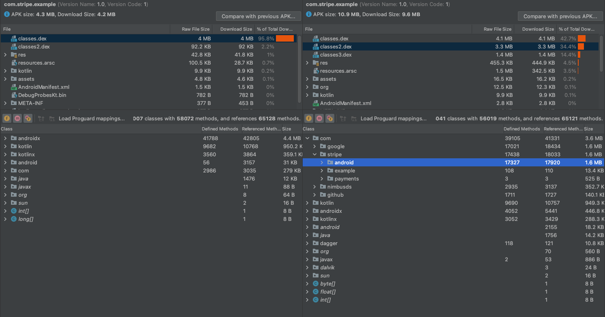

# Stripe Cash App Example

This sample demonstrates how to integrate Cash App using Stripe using the Stripe bindings (`PaymentLauncher`).
Additionally, this sample utilizes code shrinking to demonstrate the size of the Stripe module.

To run this sample, you must enter the required information in `Settings.kt`:
- `publishableKey`: The stripe publishable key can be retrieved from [Stripe Dashboard](https://dashboard.stripe.com/test/apikeys)
- `backendUrl`: The base URL of your backend

This sample demonstrates how to employ code shrinking for the purpose of condensing, obfuscating, and optimizing this app. Detailed step-by-step instructions on this procedure can be found [here](https://developer.android.com/build/shrink-code).

This analysis used code shrinking as follows:

1. In build.gradle, we enable shrinking:

```
buildTypes {
    release {
        minifyEnabled true
        shrinkResources true
        proguardFiles getDefaultProguardFile('proguard-android-optimize.txt'), 'proguard-rules.pro'
    }
}
```

2. Update proguard with the following rules:

```
-keepnames class com.stripe.android.**
-keepnames interface com.stripe.android.**
-keepnames enum com.stripe.android.**
-keepnames @interface com.stripe.android.**
```

Our comparative analysis will primarily focus on the `classes.dex`, `res`, and `resources.arsc` aspects.

Please note, the provided file sizes are estimation-based as they vary according to the shared classes between Stripe usage and non-Stripe usage, for example, coroutines, cryptography, networking, etc.

In the absence of the Stripe dependency, the approximate APK size stands at 570 KB:

classes.dex size: ~490 KB

resource size: ~37 KB

resources.arsc ~30 KB

Incorporating Stripe increases the APK size to an approximate 2.5 MB:

classes.dex size: ~1.7 MB

resource size: ~400 KB

resources.arsc ~350 KB

The respective size differentials result in an approximate 1.7 MB increase (1 MB stripe class size + 700 KB resource size). It's important to acknowledge that these figures largely hinge upon the shared dependencies between Stripe and other dependencies used within your app.

Refer to the following screenshot for visual comparison (the left image represents the app without Stripe, while the right image is with Stripe integrated):


Compared to the unminified sizes:

In the absence of the Stripe dependency, the approximate APK size stands at 4.2 MB:

classes.dex size: ~4.1 MB

resource size: ~42 KB

resources.arsc ~29 KB

Incorporating Stripe increases the APK size to an approximate 9.6 MB:

classes.dex size: ~8.9 MB

resource size: ~445 KB

resources.arsc ~343 KB

The respective size differentials result in an approximate 2.7 MB increase (2 MB stripe class size + 700 KB resource size). It's important to acknowledge that these figures largely hinge upon the shared dependencies between Stripe and other dependencies used within your app.

Refer to the following screenshot for visual comparison (the left image represents the app without Stripe, while the right image is with Stripe integrated):


