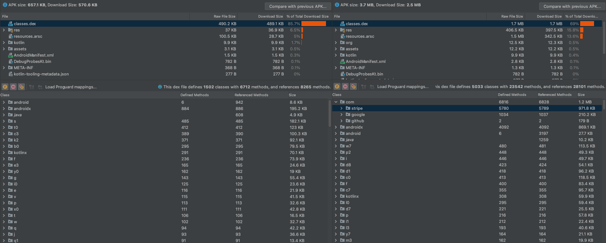

# Stripe Cash App Example

This sample demonstrates how to integrate Cash App using Stripe using the Stripe bindings (`PaymentLauncher`).
Additionally, this sample utilizes code shrinking to demonstrate the size of the Stripe module.

To run this sample, you must enter the required information in `Settings.kt`:
- `publishableKey`: The stripe publishable key can be retrieved from [Stripe Dashboard](https://dashboard.stripe.com/test/apikeys)
- `backendUrl`: The base URL of your backend

This sample uses code shrinking to shrink, obfuscate, and optimize this app, you can find instructions on how to do this [here](https://developer.android.com/build/shrink-code).

The size comparison between an app that uses Stripe and one that does not is analyzed below:

Note: the sizes are an estimate because it depends on which classes are shared between the Stripe usage and without, for example coroutines, cyrptography, networking, etc.

In this comparison we will look at `classes.dex` and `res`

The size of the apk without using Stripe dependency is roughly 570 KB:
- code ~ 490kb
- res ~ 37kb

The size of the apk with Stripe is roughly 2.5 MB:
- classes.dex ~ 1.7 MB
- res ~ 400 KB

The total differential is approximately 1.7 MB (1 MB class size + 700 KB resource size). Again, this number is largely dependent on any shared dependencies between Stripe and whichever dependencies you are using in your app.

Below is a screenshot for reference (left is without Stripe, right is with Stripe):

